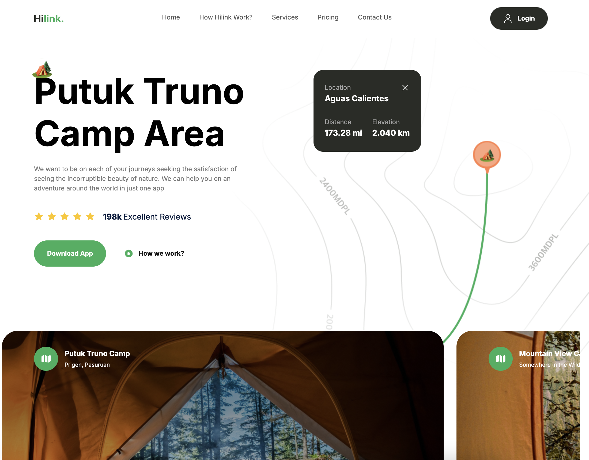
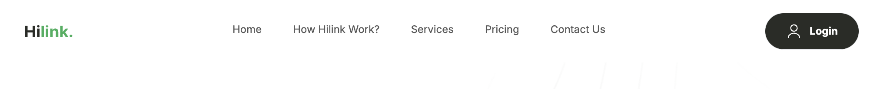
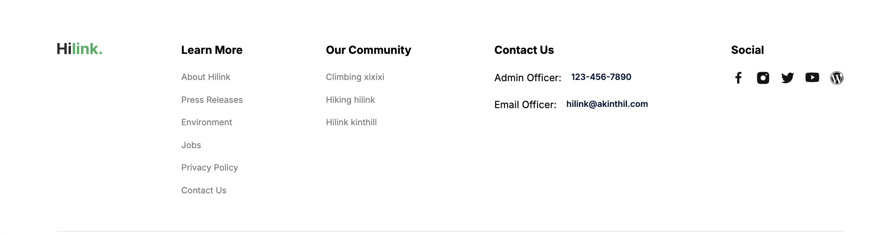
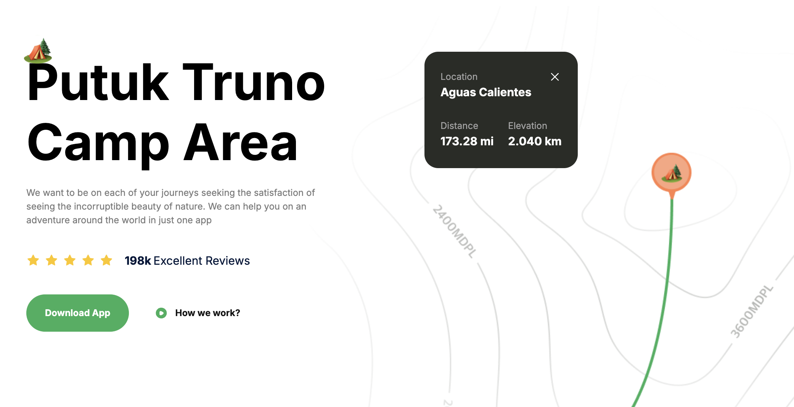
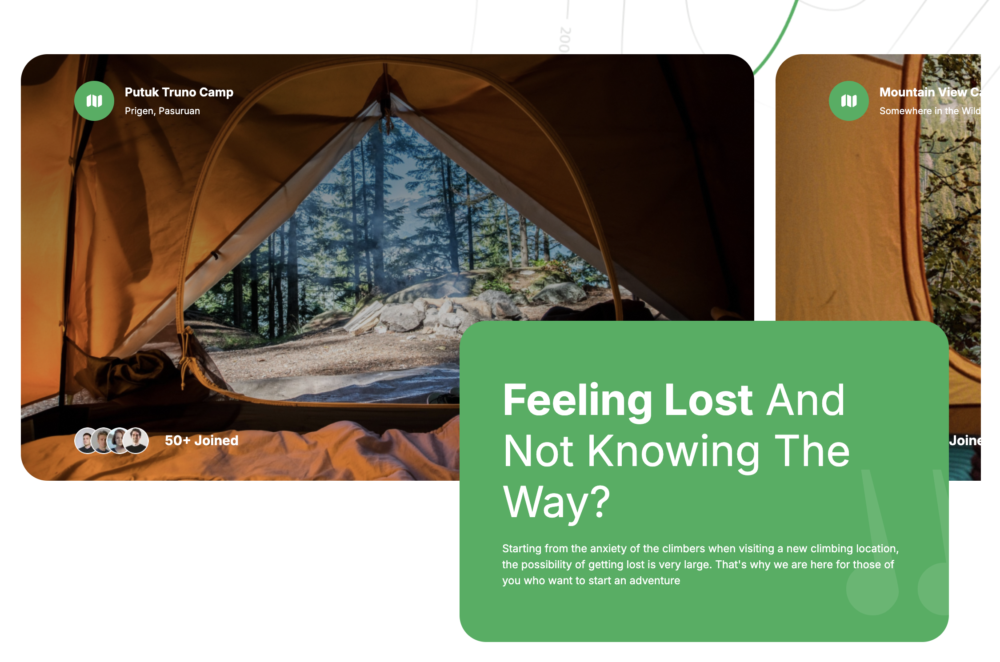
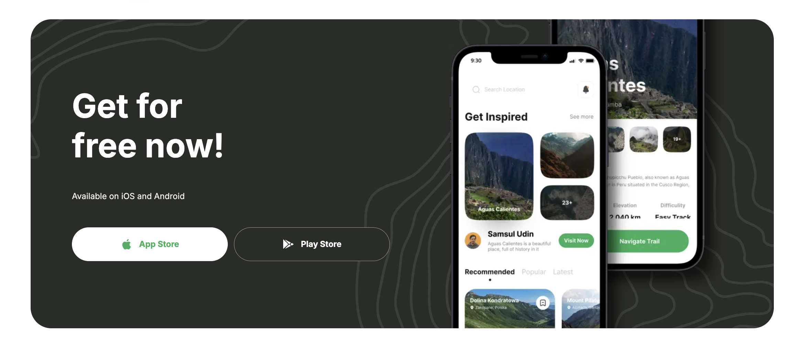

## <a name="tech-stack">⚙️ Tech Stack</a>

- Next.js
- Tailwind CSS

## <a name="features">🔋 Features</a>

👉 **Appealing Hero Section**: Visually striking hero section that captures attention and sets the tone for the website

👉 **Camp Exploration Section**: Showcase various camps in a dedicated section, allowing users to explore different options.

👉 **Engaging Travel Guide Section**: A compelling travel guide section with informative content and captivating visuals.

👉 **Feature-Rich Section**: A complex and feature-rich section offering advanced functionalities or in-depth information.

👉 **Call to Action for Mobile Apps**: A call-to-action section encouraging users to explore the mobile app version, complete with download links.

👉 **Footer**: Comprehensive footer section containing site and social media links for easy navigation and connectivity.

and many more, including code architecture and reusability 

## <a name="quick-start">🤸 Quick Start</a>

Follow these steps to set up the project locally on your machine.

**Prerequisites**

Make sure you have the following installed on your machine:

- [Git](https://git-scm.com/)
- [Node.js](https://nodejs.org/en)
- [npm](https://www.npmjs.com/) (Node Package Manager)

**Cloning the Repository**

```bash
git clone https://github.com/adrianhajdin/travel_ui_ux.git
cd travel_ui_ux
```

**Installation**

Install the project dependencies using npm:

```bash
npm install
```

**Running the Project**

```bash
npm run dev
```

Open [http://localhost:3000](http://localhost:3000) in your browser to view the project.

**ScreenShots**







